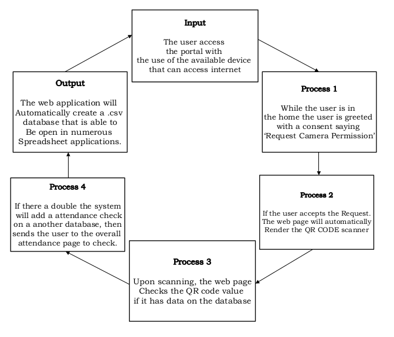
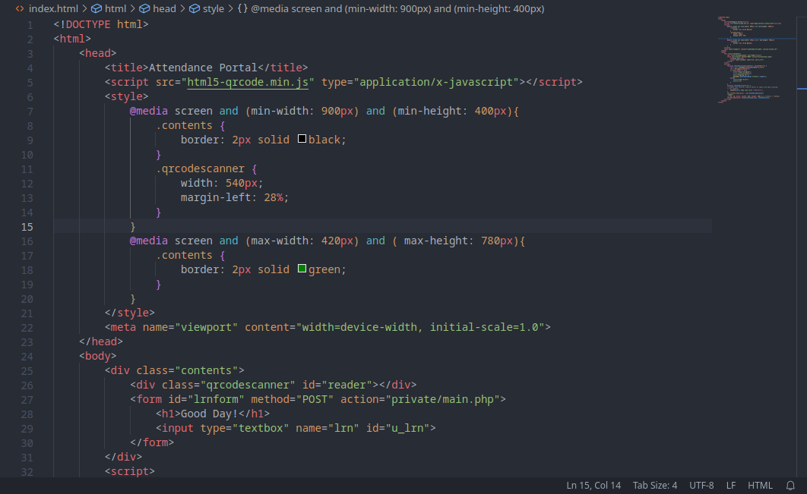
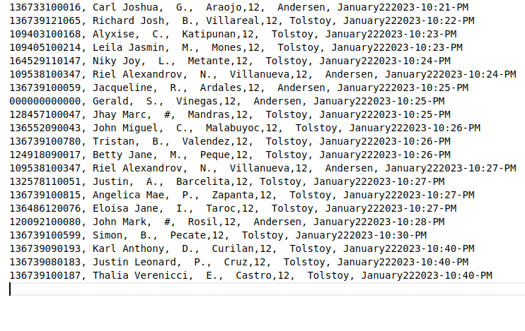

# The Automated QR Code Attendance Suite

Presented by Richard Josh B. Villareal

---
# Abstract
    Through out the decades, computer recognition has been 
    a in rough spot for development and so goes with
    The Artificial Intellegence, The research is just a simple 
    representation of what can a single idea can do to 
    the Industry, Young minds and Problems...

        It is crucial that these services should be free and
    open to the public for testing, recreation and security.
---

# Chapter 1: The Problem and Its' Background

Introduction

The Background of the Study

---

# Statement of the problem

Major themes

---
 
# Hypothesis

Alternative Hypothesis

---

# Significance of the Study

Use and future usage

---

# Chapter II: Related Literatures

Related Studies

---

# Foreign Related Literatures

Biometric Method
Biometric Recognition
RF ID
QR Code(Reed Solomon ECC)
QR Code(Fast CGI/ PHP)

---

# Theoretical Framework

Flowchart

---

---

# Chapter III: Research Methodology

Research Design

---

# Locale of Study
Sample of the Study

---

# Research Instrument

    Demostration of the Instrument

Validation of Instrument
Potential Ethical Issue

---

# Data Gathering Procedures
Statistical Analysis

---

# Chapter 4: Presentation, Analysis and Interpretation of Data
Findings and Interpretation of Data

---

---

# Chapter 5: Conclusion and Recommendation

---

# Das Ende

Vielen Dank fürs Zuhöre